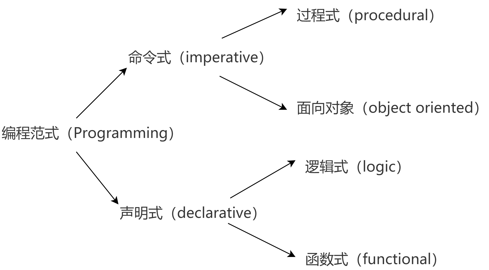

# 消除坏味道：重复的代码与函数式编程

### 无处不在的重复代码

​		在项目实现时，经常把一段代码复制过来，改动几个地方，然后，跑一下没有问题就结束了。复制的时候很高效但其实是在给未来挖坑。

​        重复代码导致了相同的逻辑会分散到项目的多个地方。可能引发的问题是一个简单的需求，要改很多地方，需要花费很长的时间。更可怕的是会有漏改的风险，就意味着留下了潜在的问题。

​        Ctrl+C、Ctrl+V导致的重复代码是比较容易发现的，很多时候IDE也会提示出来。但是重复的代码结构也是重复代码，这类的重复却经常被忽视。

```java
public void sendBook() {
  try {
    this.service.sendBook();
  } catch (Throwable t) {
    this.notification.send(new SendFailure(t)));
    throw t;
  }
}
```

```java
public void sendChapter() {
  try {
    this.service.sendChapter();
  } catch (Throwable t) {
    this.notification.send(new SendFailure(t)));
    throw t;
  }
}
```

```java
public void startTranslation() {
  try {
    this.service.startTranslation();
  } catch (Throwable t) {
    this.notification.send(new SendFailure(t)));
    throw t;
  }
}
```

这三个函数可能在许多人看来已经写得很简洁了，但是，这段代码的结构上却是有重复的。我们可以看到，虽然这三个函数调用的业务代码不同，但它们的结构是一致的，其基本流程可以理解为：

​	1.调用业务函数

​	2.如果出错，发通知

```java
private void executeTask(final Runnable runnable) {
  try {
    runnable.run();
  } catch (Throwable t) {
    this.notification.send(new SendFailure(t)));
    throw t;
  }
}
```

```java
public void sendBook() {
  executeTask(this.service::sendBook);
}
```

```java
public void sendChapter() {
  executeTask(this.service::sendChapter);
}
```

```java
public void startTranslation() {
  executeTask(this.service::startTranslation);
}
```


### 函数式编程

## 两种编程范式：命令式与声明式

编程范式有两种，分别是命令式和声明式，命令式强调做的步骤也就是怎么做，而声明式强调做什么本身，以及做的结果。因此，编程语言也可以分成命令式和声明式两种类型，如果再细分的话，命令式又可以分成过程式和面向对象，而声明式则可以分成逻辑式和函数式。下面这张图列出了编程语言的分类和每个类型下经典的编程语言。




命令式强调怎么做，而声明式强调做什么 用到了什么算子

#### 高阶函数 

所谓高阶函数，是指输入参数是函数，或者返回值是函数的函数。高阶函数可以用数学中的复合函数f(g(x))来类比，更好理解一些。

高阶函数的重要作用在于可以利用它去做行为的组合。高阶函数的出现，让程序的编写方式出现了质变。按照传统的方式，程序库的提供者要提供一个又一个的完整功能，但按照函数式编程的理念，提供者提供的就变成了一个又一个简单的构造块。然后，使用者可以根据自己的需要进行组合，非常灵活，甚至可以创造出我们未曾想过的组合方式。

**模型提供者提供出来的是一个又一个的构造块，以及它们的组合方式。由使用者根据自己需要将这些构造块组合起来，提供出新的模型，供其他开发者使用**。就这样，模型之间一层又一层地逐步叠加，最终构建起我们的整个应用。

**函数式编程的组合性**,使用高阶函数,可以使我们更好的对过程进行抽象。

你会发现函数式和面向对象其实是在以不同的视角来观察这个世界的，在面向对象的世界里，一切是静止的，你需要一个一个的对象分离出来，而函数式的世界中，一切充满着变化，你需要关注的是变化的前因后果将一个变化拆解为不同的变化->  f(x) = g(f(c(x))) 。面向对象组合的元素是类和对象，而函数式编程组合的是函数。都是组合的艺术。**我们可以用面向对象编程的方式对系统的结构进行搭建，然后，用函数式编程的理念对函数接口进行设计**。你可以把它理解成盖楼，用面向对象编程搭建大楼的骨架，用函数式编程设计门窗。


2个案例吧 一个是分页获数据的，一个是查询全量数据的
